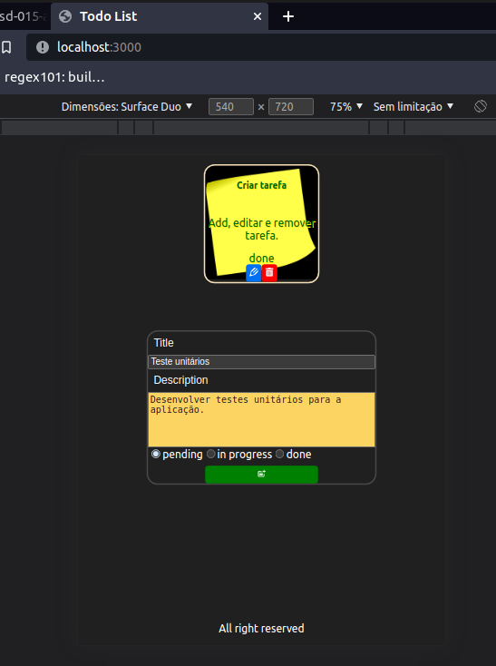

# 🚀 Todo list com flask, mongodb e nextjs

### Exercício de criação de um todo list em python

- [x] Criar CRUD em python
- [x] Criar db com container mongo
- [x] Criar frontend com Next.js (adicionar, atualizar e remover tarefa)
- [x] Dockerizar aplicação
- [ ] Criar testes unitários

## Instruções de instalação

### Clone o projeto

### Build a aplicação

### `mpm start`

### Abra o navegador e acesse:

### `http://localhost:3000/`

### Scrips

### docker-compose up

### `npm start`

### docker-compose stop

### `npm stop`

## Contatos

https://www.linkedin.com/in/fernandosenacruz/

https://fatnando-portfolio-cg38.vercel.app/